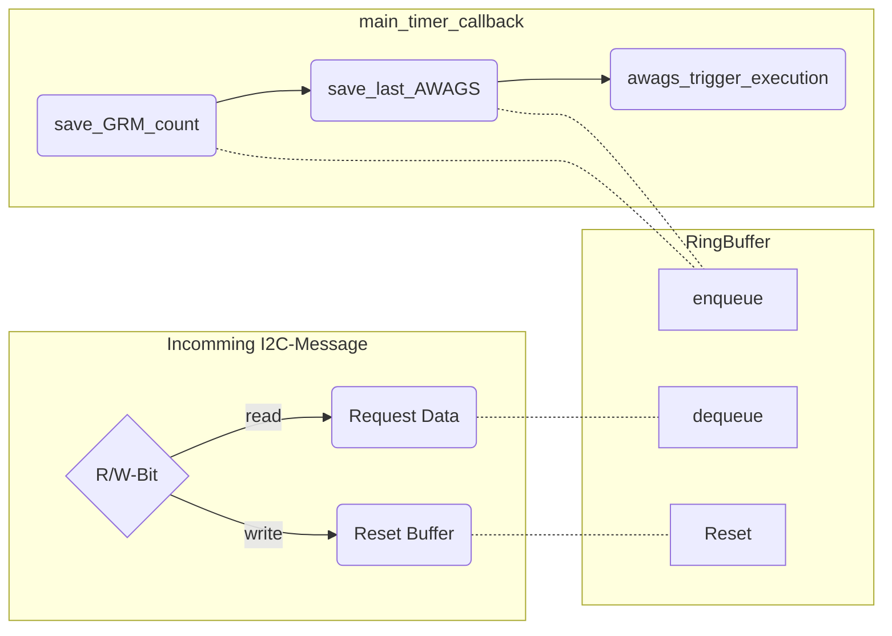
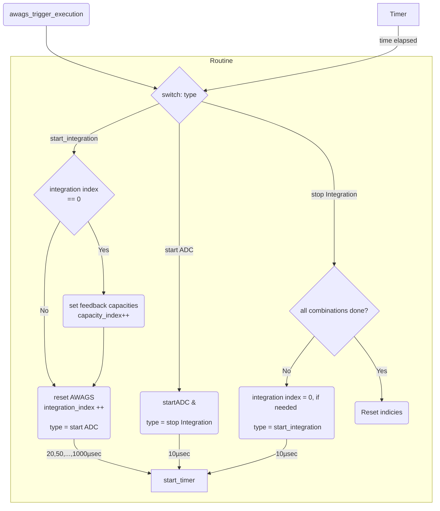

## Main Execution Loop

```mermaid
flowchart LR
    subgraph RingBuffer 
        direction LR
        enqueue
        dequeue
        Reset
    end

    subgraph Incomming I2C-Message 
        direction LR
        if_state{ R/W-Bit}
        W(Reset Buffer)
        R(Request Data)
        if_state -->|write| W
        W -.- Reset
        if_state -->|read| R
        R -.- dequeue
    end

    subgraph main_timer_callback 
      direction LR
      a(save_GRM_count)
      b(save_last_AWAGS)
      c(awags_trigger_execution)
      a -.- enqueue
      b -.- enqueue


      a-->b
      b-->c
    end
```
## AWAGS Routine

```mermaid
    flowchart TD
        start(awags_trigger_execution)--> switch
        Timer -->|time elapsed| switch
        subgraph Routine
            switch{switch: type} -->|start_integration|A
            A{integration index \n == 0} -->|No| A1
            A -->|Yes| A2
            A2(set feedback capacities \n capacity_index++)-->A1
            A1(reset AWAGS \n integration_index ++\n\n type = start ADC)-->|20,50,...,1000µsec| start_timer
            switch -->|start ADC|B
            B(startADC & \n\n type = stop Integration) -->|10µsec|start_timer
            switch -->|stop Integration|C
            C{all combinations done?} -->|No|C2
            C-->|Yes|C1
            C1(Reset indicies)
            C2(integration index = 0, if needed \n\n type = start_integration)-->|10µsec|start_timer
        end
```