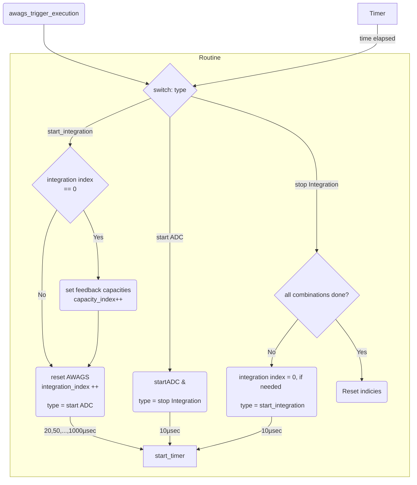
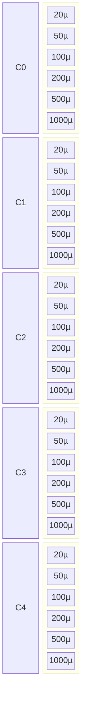

## Main Execution Loop

```mermaid
flowchart LR
    subgraph RingBuffer 
        direction LR
        enqueue
        dequeue
        Reset
    end

    subgraph Incoming I2C-Message 
        direction LR
        if_state{ R/W-Bit}
        W(Reset Buffer)
        R(Request Data)
        if_state -->|write| W
        W -.- Reset
        if_state -->|read| R
        R -.- dequeue
    end

    subgraph main_timer_callback: 50ms Period
      direction LR
      a(save_GRM_count)
      b(save_last_AWAGS)
      c(awags_trigger_execution)
      a -.- enqueue
      b -.- enqueue


      a-->b
      b-->c
    end
```
## AWAGS Routine

```mermaid
    flowchart TD
        start(awags_trigger_execution)--> switch
        Timer -->|time elapsed| switch
        subgraph Routine
            switch{switch: type} -->|start_integration|A
            A{integration index \n == 0} -->|No| A1
            A -->|Yes| A2
            A2(set feedback capacities \n capacity_index++)-->A1
            A1(reset AWAGS \n integration_index ++\n\n type = start ADC)-->|20,50,...,1000µsec| start_timer
            switch -->|start ADC|B
            B(startADC & \n\n type = stop Integration) -->|10µsec|start_timer
            switch -->|stop Integration|C
            C{all combinations done?} -->|No|C2
            C-->|Yes|C1
            C1(Reset indicies)
            C2(integration index = 0, if needed \n\n type = start_integration)-->|10µsec|start_timer
        end
```

#### Data Array

```mermaid
block-beta
  columns 2
  C0
  block:group0:1
    columns 1
    c01["20µ"] c02["50µ"] c03["100µ"] c04["200µ"] c05["500µ"] c06["1000µ"]
  end
  C1
  block:group1:1
    columns 1
    c11["20µ"] c12["50µ"] c13["100µ"] c14["200µ"] c15["500µ"] c16["1000µ"]
  end
  C2
  block:group2:1
    columns 1
    c21["20µ"] c22["50µ"] c23["100µ"] c24["200µ"] c25["500µ"] c26["1000µ"]
  end
  C3
  block:group3:1
    columns 1
  c31["20µ"] c32["50µ"] c33["100µ"] c34["200µ"] c35["500µ"] c36["1000µ"]
  end
  C4
  block:group:1
    columns 1
  c41["20µ"] c42["50µ"] c43["100µ"] c44["200µ"] c45["500µ"] c46["1000µ"]
  end


```